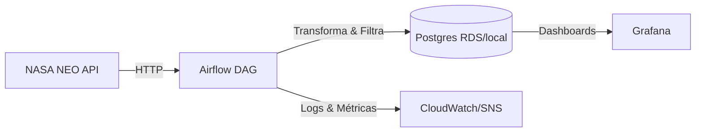

## Monitoria de Asteroides – Airflow + Postgres + Grafana (Free Tier friendly)

   

Pipeline ETL diário que coleta a NASA NEO API, filtra apenas asteroides de interesse (hazard, “Atlas”, prefixo “3I”), persiste em Postgres e entrega dashboards prontos no Grafana. Pensado para operar em Free Tier (baixo consumo, limpeza automática e alertas de custo/armazenamento).

### Arquitetura (visão rápida)


### Diferenciais
- **Monitoria focada**: salva só eventos críticos (hazard, “Atlas”, “3I”); menos ruído e custo.
- **Free Tier**: coleta diária, limpeza de dados >90 dias, alertas de uso/custo.
- **Pronto para BI**: tabela dedicada `asteroides_monitoria` otimizada para dashboards.
- **Infra como código**: Terraform para S3/IAM/RDS/SNS/CloudWatch; Docker Compose para Airflow + Postgres + Grafana.

## Features
- Coleta diária da NASA API (NEO feed).
- Filtro de asteroides de alerta (hazard, nome contendo “atlas” ou começando com “3i”).
- Upsert em `asteroides_monitoria` (dedup por id+data) e limpeza automática de 90 dias.
- Dashboards Grafana prontos: tabela de alertas, eventos por dia, proximidade vs magnitude, filtros Atlas/3I, contagem de hazard/3I.
- Task de healthcheck no DAG validando env + conectividade NASA.

## Instalação e Uso (local/Docker)
1) Copie `.env.example` para `.env` e preencha:
   - `NASA_API_KEY`
   - Credenciais AWS/Postgres (se usando RDS/S3 via Terraform outputs).
2) (Opcional) Provisionar infra AWS Free Tier:
   ```bash
   cd infra/terraform
   terraform init
   terraform plan
   terraform apply
   terraform output -json > ../terraform_outputs.json
   cd ..
   python scripts/populate_env.py --outputs infra/terraform_outputs.json
   ```
3) Suba os contêineres:
   ```bash
   docker-compose down
   docker-compose up -d --build
   ```
4) No Airflow (`http://localhost:8080`, admin/admin):
   - Crie a Connection `nasa_api` (HTTP, host https://api.nasa.gov).
   - Rode o DAG `nasa_etl_dag` (healthcheck → extract → transform → load).
5) No Grafana (`http://localhost:3001`, admin/admin):
   - Configure datasource Postgres (mesmo banco do Airflow).
   - Importe/ajuste `dashboards/grafana/provisioning_template.json`.

## Modelo de dados (Postgres)
- Tabela `asteroides_monitoria`:
  - PK composta `(id, close_approach_date)`
  - Campos: `name`, `close_approach_date`, `absolute_magnitude_h`, `relative_velocity_km_s`, `miss_distance_km`, `alert_tag`, `is_potentially_hazardous_asteroid`, `details_json`, `created_at`
  - Limpeza: `close_approach_date < current_date - 90 days`

Upsert usado no loader:
```sql
INSERT INTO asteroides_monitoria (...) VALUES (...)
ON CONFLICT (id, close_approach_date) DO UPDATE SET ...;
```

## Dashboards Grafana (já em JSON)
- Tabela “Asteroides de alerta” (últimos eventos).
- Contagem de hazard (90d) e interestelares (3I).
- Eventos por dia (30d).
- Proximidade vs magnitude (time series).
- Filtro dedicado para “Atlas” e “3I”.
Arquivo: `dashboards/grafana/provisioning_template.json`.

## Boas práticas Free Tier
- Frequência diária (@daily) para minimizar chamadas à API.
- Limpeza automática de dados >90 dias; versionamento S3 desabilitado.
+- Alerta de custo/armazenamento via SNS+CloudWatch (config Terraform).
- Ajuste `bucket_name` único no Terraform e mantenha instância RDS micro (20GB).

## Contribuição e contato
- Issues e PRs são bem-vindos.
- Autor: Leonardo (leoboas02@gmail.com) – abra uma issue para sugestões/melhorias.

## Status
- Tests: `pytest --ignore=airflow/logs`
- CI/CD: workflow pronto (ajuste segredos e buckets).
