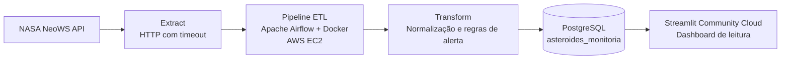

# NASA NEO Mission Control

[](https://www.python.org/)
[](https://airflow.apache.org/)
[](https://www.postgresql.org/)
[](https://streamlit.io/cloud)
[](https://www.docker.com/)

**Dashboard ao vivo:** [nasaetl.streamlit.app](https://nasaetl.streamlit.app/)

## Visão geral

O NASA NEO Mission Control é um projeto de Engenharia de Dados voltado ao monitoramento de objetos próximos à Terra (Near-Earth Objects, NEOs). O pipeline consulta a API NASA NeoWS, normaliza o payload, seleciona eventos relevantes e persiste uma visão analítica idempotente no PostgreSQL. Um dashboard Streamlit apresenta KPIs, filtros, visualizações e exportação CSV em modo somente leitura.

O objetivo de negócio é transformar o feed público da NASA em uma base confiável e atualizável para análise de risco, priorizando asteroides potencialmente perigosos e ocorrências relacionadas a `Atlas` ou `3I`.

## Arquitetura


```mermaid
flowchart LR
    NASA[NASA NeoWS API] --> EXTRACT[Extract\nHTTP com timeout]
    EXTRACT --> AIRFLOW[Pipeline ETL\nApache Airflow + Docker\nAWS EC2]
    AIRFLOW --> TRANSFORM[Transform\nNormalização e regras de alerta]
    TRANSFORM --> DB[(PostgreSQL\nasteroides_monitoria)]
    DB --> DASH[Streamlit Community Cloud\nDashboard de leitura]
```

Na EC2, o repositório também disponibiliza um runner Python leve acionado por `systemd` para ambientes com pouca memória. Ele reutiliza o mesmo núcleo de ETL e o mesmo contrato de dados do fluxo Airflow/Docker.

## Stack tecnológico

| Camada | Tecnologia | Responsabilidade |
|---|---|---|
| Fonte | NASA NeoWS API | Feed diário de objetos próximos à Terra |
| Orquestração | Apache Airflow + Docker | Agenda, execução e observabilidade local do ETL |
| Compute | AWS EC2 | Hospedagem do pipeline e do PostgreSQL operacional |
| Persistência | PostgreSQL | UPSERT idempotente da tabela analítica |
| Transformação | Python 3.11, Pandas, SQLAlchemy | Normalização, filtros de alerta e carga |
| Visualização | Streamlit Cloud + Plotly | KPIs, gráficos, filtros e download CSV |
| Infraestrutura | Terraform, Docker Compose, systemd | Provisionamento e operação reproduzível |

## Estrutura do repositório

```text
.
├── app.py                         # Dashboard Streamlit
├── etl/                           # Núcleo de extract, transform e load
├── airflow/                       # DAG, hooks e operators do Airflow
├── db/migrations/                 # Schema PostgreSQL versionado
├── deploy/                        # Docker Compose e unidades systemd da EC2
├── infra/ec2/                     # Módulo Terraform canônico para EC2
├── infra/ec2-education/           # Variante para contas AWS Education
├── infra/terraform/               # Módulo RDS/S3 de compatibilidade
├── tests/                         # Testes unitários do ETL
├── requirements.txt               # Dependências mínimas do Streamlit Cloud
├── requirements.runtime.txt       # Dependências do runner leve
└── requirements-dev.txt           # Airflow e ferramentas de teste
```

`infra/ec2` é a referência para uma nova implantação em EC2. Os módulos `ec2-education` e `terraform` atendem cenários de infraestrutura distintos já existentes; revise o plano Terraform antes de aplicá-los.

## Modelo de dados

O dashboard consulta exclusivamente `asteroides_monitoria`. A chave composta evita duplicidade ao reprocessar a mesma aproximação.

| Coluna | Tipo | Descrição |
|---|---|---|
| `id` | `TEXT` | Identificador da NASA; parte da chave primária |
| `close_approach_date` | `DATE` | Data da aproximação; parte da chave primária |
| `name` | `TEXT` | Nome do objeto |
| `absolute_magnitude_h` | `DOUBLE PRECISION` | Magnitude absoluta |
| `relative_velocity_km_s` | `DOUBLE PRECISION` | Velocidade relativa em km/s |
| `miss_distance_km` | `DOUBLE PRECISION` | Distância mínima estimada em km |
| `alert_tag` | `TEXT` | Tags de negócio: `hazard`, `atlas` e/ou `3i` |
| `is_potentially_hazardous_asteroid` | `BOOLEAN` | Sinalizador oficial de risco da NASA |
| `details_json` | `JSONB` | Payload selecionado para auditoria e métricas derivadas |
| `created_at` | `TIMESTAMPTZ` | Momento de inserção do registro |

Há índices para consulta por data de aproximação e para eventos classificados como perigosos.

## Execução local

### 1. Preparar variáveis locais

```powershell
Copy-Item .env.example .env
```

Edite o `.env` com uma chave válida da NASA e credenciais locais do PostgreSQL. O arquivo é ignorado pelo Git. Para desenvolvimento do dashboard diretamente no host, mantenha `POSTGRES_HOST=localhost`; o Compose publica o banco apenas em `127.0.0.1:5432`.

### 2. Subir PostgreSQL e Airflow em Docker

```powershell
docker compose up -d --build
docker compose ps
docker compose logs -f airflow-scheduler
```

O Airflow fica disponível apenas em `http://127.0.0.1:8080`. Para executar somente o banco e testar o runner leve:

```powershell
docker compose up -d postgres
docker compose --profile runner run --rm runner
```

### 3. Rodar o dashboard

```powershell
py -3.11 -m venv .venv
.\.venv\Scripts\Activate.ps1
python -m pip install --upgrade pip
pip install -r requirements.txt
streamlit run app.py
```

O dashboard aceita as variáveis `POSTGRES_*` do `.env` local. Em produção, os valores dos Secrets `DB_*` têm prioridade.

### 4. Executar testes do ETL

Em Linux, macOS ou Docker, instale o ambiente de desenvolvimento respeitando as constraints do Airflow:

```bash
python -m pip install --upgrade pip
pip install --constraint https://raw.githubusercontent.com/apache/airflow/constraints-2.9.0/constraints-3.11.txt -r requirements-dev.txt
pytest
```

No Windows, os testes de plugins Airflow são ignorados porque o Airflow não possui suporte nativo à plataforma. O restante da suíte permanece executável.

## Publicação no Streamlit Community Cloud

O `requirements.txt` da raiz é deliberadamente enxuto e contém somente as dependências do dashboard:

```text
streamlit>=1.36.0
pandas>=2.2.0
psycopg2-binary>=2.9.9
sqlalchemy>=2.0.0
plotly>=5.22.0
python-dotenv>=1.0.0
```

No painel da aplicação Streamlit, abra **Settings → Secrets** e cadastre TOML de nível superior neste formato:

```toml
DB_HOST = "postgres.example.com"
DB_PORT = 5432
DB_NAME = "nasa_etl"
DB_USER = "streamlit_readonly"
DB_PASSWORD = "substitua-por-uma-senha-rotacionada"

# Inclua apenas quando o servidor PostgreSQL exigir TLS.
DB_SSLMODE = "require"
```

Não inclua cabeçalhos como `[database]`: o dashboard usa as chaves `DB_*` no nível raiz. Após salvar os Secrets, reinicie a aplicação se necessário. O arquivo local `.streamlit/secrets.toml` também deve permanecer fora do Git.

> Segurança: o Streamlit Cloud precisa alcançar o PostgreSQL por uma rota de rede controlada. Em produção, use TLS e restrinja o acesso no firewall ou em um proxy de banco. Nunca publique credenciais, state Terraform, arquivos `.env` ou a porta PostgreSQL sem controles de rede.

## Implantação na AWS EC2

O módulo [`infra/ec2`](infra/ec2) provisiona uma EC2 Ubuntu com IMDSv2, disco criptografado, role SSM e SSH restrito ao CIDR administrativo.

```powershell
Copy-Item infra/ec2/terraform.tfvars.example infra/ec2/terraform.tfvars
# Edite key_pair_name, admin_cidr e repository_ref.
terraform -chdir=infra/ec2 init
terraform -chdir=infra/ec2 plan
terraform -chdir=infra/ec2 apply
```

Depois do bootstrap, armazene o ambiente operacional em `/etc/nasa-etl/nasa-etl.env` com permissões `600`, fora do repositório. O timer `nasa-etl.timer` agenda o job diário e o serviço `nasa-etl.service` executa o container do ETL.

## Qualidade e confiabilidade

- Timeouts explícitos e propagação de erro para chamadas da API NASA.
- Transformação determinística e regras de alerta testáveis.
- UPSERT por `(id, close_approach_date)` para reprocessamento seguro.
- Senhas convertidas com `SQLAlchemy.URL.create`, sem interpolação manual de URL.
- Pools de conexão reduzidos e `pool_pre_ping` no dashboard Streamlit.
- Estados claros para banco indisponível, tabela vazia, filtros sem resultados e dados incompletos.
- CI separada: validação leve do dashboard e suíte Airflow/ETL com constraints compatíveis.

## Licença

Distribuído sob a licença presente em [LICENSE](LICENSE).
