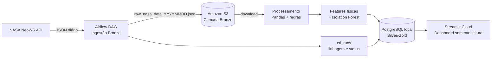

# NASA NEO Mission Control

[](https://www.python.org/)
[](https://aws.amazon.com/s3/)
[](https://airflow.apache.org/)
[](https://www.postgresql.org/)
[](https://docs.docker.com/compose/)
[](https://streamlit.io/cloud)

## Dashboard ao vivo

### [Abrir o NASA NEO Mission Control](https://nasaetl.streamlit.app/)

Pipeline diário para monitorar objetos próximos à Terra (NEOs), preservar o
payload original e entregar uma camada analítica auditável para o dashboard.

## Arquitetura


```mermaid
flowchart LR
    NASA[NASA NeoWS API] -->|JSON diário| INGEST[Airflow DAG<br/>Ingestão Bronze]
    INGEST -->|raw_nasa_data_YYYYMMDD.json| S3[(Amazon S3<br/>Camada Bronze)]
    S3 -->|download| PROC[Processamento<br/>Pandas + regras]
    PROC --> ML[Features físicas<br/>+ Isolation Forest]
    ML --> PG[(PostgreSQL local<br/>Silver/Gold)]
    PG --> DASH[Streamlit Cloud<br/>Dashboard somente leitura]
    INGEST --> OBS[etl_runs<br/>linhagem e status]
    OBS --> PG
```

O Airflow usa `LocalExecutor`. O PostgreSQL analítico é o container local da
EC2 (`postgres`); o Airflow mantém um banco de metadados separado.

## Camadas de dados

- **Bronze:** JSON original da NASA, particionado por data no S3 e protegido com SSE-S3.
- **Silver:** registros normalizados com datas, tipos e unidades padronizados.
- **Gold:** `public.asteroides_monitoria`, carregada via UPSERT pela chave
  `(id, close_approach_date)`.
- **Observabilidade:** `public.etl_runs` registra volume, duração e status.

## FinOps e arquitetura sustentável

A solução foi desenhada para instâncias pequenas e ambientes Free Tier:

- `LocalExecutor`, sem Celery nem workers adicionais.
- Concorrência e pool de conexões limitados.
- JSON bruto no S3 para evitar crescimento do disco da EC2.
- Retenção configurável de artefatos locais.
- Execução diária em vez de polling contínuo.

## Estrutura

```text
.
├── app.py                         # Dashboard Streamlit
├── etl/                           # Extract, Transform e Load
├── airflow/dags/                  # NASA -> S3 -> PostgreSQL
├── airflow/plugins/               # Hooks e Operators
├── db/migrations/                 # Migrações versionadas
├── deploy/compose/                # Compose da EC2
├── deploy/systemd/                # Timer alternativo
├── infra/ec2/                     # Terraform
├── tests/                         # Testes unitários
├── requirements.txt               # Dashboard
└── requirements.airflow.txt       # Airflow
```

## Execução local

Copie o template e preencha somente valores locais:

```powershell
Copy-Item .env.example .env
```

Para containers, mantenha `POSTGRES_HOST=postgres`:

```dotenv
POSTGRES_HOST=postgres
POSTGRES_PORT=5432
POSTGRES_DB=nasa_etl
POSTGRES_USER=nasa_app
POSTGRES_PASSWORD=uma-senha-local
AWS_DEFAULT_REGION=us-east-2
S3_BUCKET_NAME=seu-bucket-bronze
```

Suba os serviços:

```powershell
docker compose up -d --build
docker compose ps
docker compose logs -f airflow-scheduler
```

O Airflow local fica em `http://127.0.0.1:8080`.

Execute o dashboard:

```powershell
py -3.11 -m venv .venv
.\.venv\Scripts\Activate.ps1
python -m pip install --upgrade pip
pip install -r requirements.txt
streamlit run app.py
```

Teste o código:

```bash
python -m pip install -r requirements-dev.txt
pytest -q
```

## Operação na AWS EC2

Use somente o overlay de produção:

```bash
sudo docker compose \
  --env-file /etc/nasa-etl/nasa-etl.env \
  -f /opt/nasa-etl/deploy/compose/docker-compose.airflow.ec2.yml \
  up -d --build
```

Validação:

```bash
sudo docker ps
sudo docker exec nasa-etl-runtime-airflow-scheduler-1 airflow dags list
sudo systemctl is-active nasa-etl.timer
free -h
```

Ative apenas um agendador (Airflow ou systemd) para evitar coletas duplicadas.

## Segurança e confiabilidade

- Credenciais são injetadas por ambiente e nunca ficam no Git.
- O dashboard usa usuário de leitura e cache de cinco minutos.
- O bucket S3 permanece privado e criptografado.
- Timeouts, retries e `pool_pre_ping` evitam falhas silenciosas.
- UPSERT torna o reprocessamento idempotente.
- Métricas físicas e anomalias são análises, não previsões oficiais de impacto.

## Data Quality e Machine Learning

Antes de qualquer escrita no PostgreSQL, o contrato de dados verifica colunas
obrigatórias, chaves duplicadas, datas, valores numéricos e JSON. Lotes inválidos
são registrados como warning e interrompidos de forma atômica.

O dashboard calcula features estáveis para o Isolation Forest, incluindo
transformações logarítmicas e a proporção diâmetro/velocidade. A detecção é uma
triagem estatística reproduzível; avaliações oficiais de impacto continuam
dependendo dos dados do CNEOS Sentry.

## Licença

Consulte [LICENSE](LICENSE).
